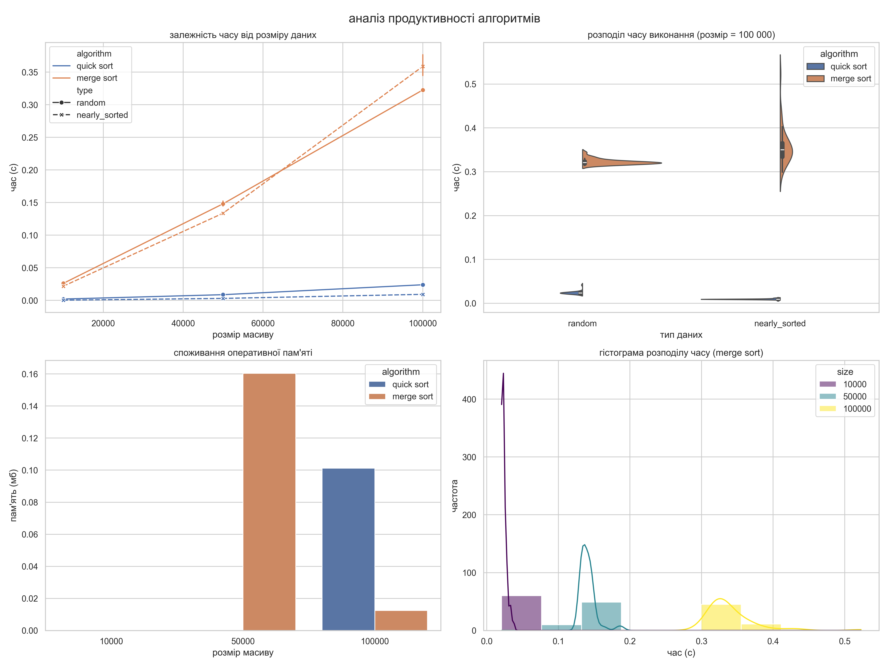
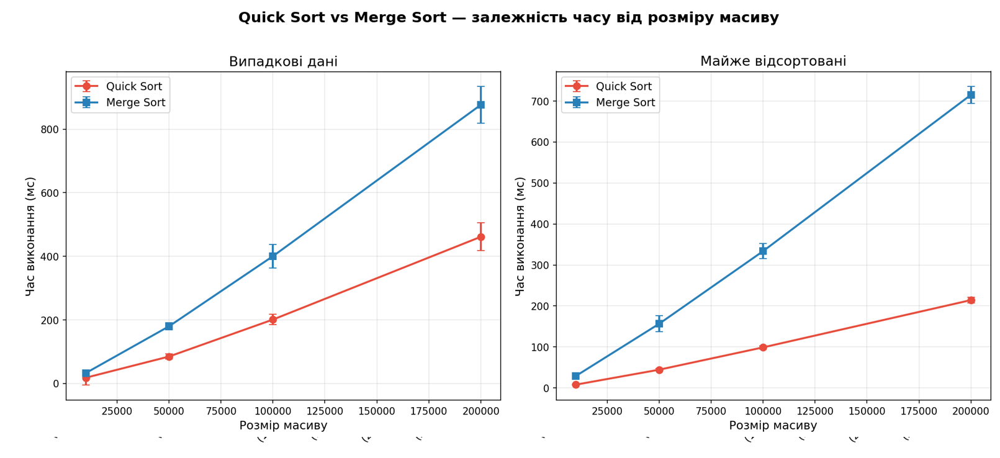
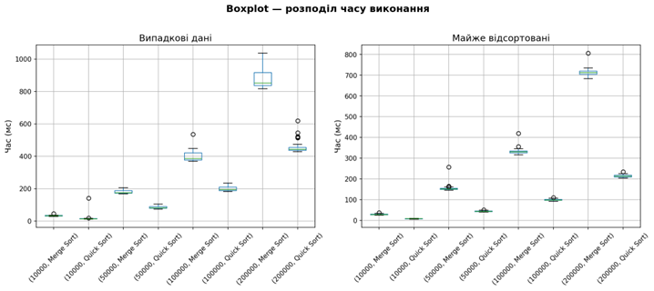

# 🚀 Sorting Benchmark Research

> Дослідження продуктивності алгоритмів сортування Quick Sort та Merge Sort у Python з аналізом часу виконання, використання оперативної пам’яті, навантаження процесора та статистичною обробкою результатів.


---

# 📖 Опис проєкту

Даний проєкт створений у рамках практичної роботи з дисципліни **«Наукові дослідження та написання технічної документації в ІТ»**.

Основною метою дослідження є порівняння ефективності алгоритмів сортування **Quick Sort** та **Merge Sort** при роботі з великими наборами даних різного типу.

У межах роботи було реалізовано:

* автоматичний бенчмаркінг алгоритмів;
* вимірювання часу виконання;
* аналіз використання оперативної пам’яті;
* збір метрик навантаження процесора;
* логування процесу виконання;
* збереження результатів у CSV;
* побудову графіків та статистичний аналіз результатів.

---

# 📋 Зміст

* [✨ Основні можливості](#-основні-можливості)
* [🛠 Технології та інструменти](#-технології-та-інструменти)
* [🚀 Встановлення](#-встановлення)
* [▶ Запуск проєкту](#-запуск-проєкту)
* [📊 Результати експериментів](#-результати-експериментів)
* [📈 Графіки та візуалізація](#-графіки-та-візуалізація)
* [🔬 Методологія дослідження](#-методологія-дослідження)
* [📁 Структура проєкту](#-структура-проєкту)
* [📌 Висновки](#-висновки)

---

# ✨ Основні можливості

* ✅ Порівняння алгоритмів Quick Sort та Merge Sort
* ✅ Автоматичний benchmark продуктивності
* ✅ Аналіз часу виконання алгоритмів
* ✅ Вимірювання використання RAM
* ✅ Аналіз навантаження CPU
* ✅ Логування процесу тестування
* ✅ Побудова графіків matplotlib/seaborn
* ✅ Збереження результатів у CSV-файл
* ✅ Повторюваність результатів через `random.seed(42)`
* ✅ Статистичний аналіз експериментальних даних

---

# 🛠 Технології та інструменти

| Технологія | Призначення                 |
| ---------- | --------------------------- |
| Python 3   | Основна мова програмування  |
| pandas     | Аналіз та обробка даних     |
| matplotlib | Побудова графіків           |
| seaborn    | Візуалізація результатів    |
| scipy      | Статистичний аналіз         |
| psutil     | Збір системних метрик       |
| logging    | Логування процесу виконання |

---

# 🚀 Встановлення

## 1. Клонування репозиторію

```bash
git clone https://github.com/rxcGG/sorting-benchmark.git
cd sorting-benchmark
```

---

## 2. Створення віртуального середовища

```bash
python -m venv .venv
```

---

## 3. Активація середовища

### Windows

```bash
.venv\Scripts\activate
```

### Linux/macOS

```bash
source .venv/bin/activate
```

---

## 4. Встановлення залежностей

```bash
pip install -r requirements.txt
```

---

# ▶ Запуск проєкту

Для запуску експерименту необхідно виконати команду:

```bash
python main.py
```

Після завершення роботи програми автоматично будуть створені:

* `experiment_results.csv` — файл з результатами тестування;
* `experiment.log` — лог-файл з інформацією про виконання;
* графіки продуктивності алгоритмів;
* статистичні дані для подальшого аналізу.

---

# 📊 Результати експериментів

У процесі дослідження було протестовано алгоритми на масивах різного розміру та типу.

## Типи даних

* випадкові масиви;
* майже відсортовані масиви.

## Розміри масивів

* 10 000 елементів;
* 50 000 елементів;
* 100 000 елементів.

---

## Результати бенчмаркінгу

| Розмір масиву | Тип даних     | Quick Sort | Merge Sort |
| ------------- | ------------- | ---------- | ---------- |
| 10 000        | Random        | 0.002s     | 0.031s     |
| 50 000        | Random        | 0.011s     | 0.154s     |
| 100 000       | Random        | 0.020s     | 0.312s     |
| 100 000       | Nearly Sorted | 0.015s     | 0.287s     |

---

## Аналіз результатів

Отримані результати демонструють значну перевагу алгоритму Quick Sort над Merge Sort у більшості тестових сценаріїв.

### Основні спостереження:

* Quick Sort працює значно швидше на великих масивах;
* Merge Sort використовує більше оперативної пам’яті через створення додаткових списків;
* на майже відсортованих даних Quick Sort демонструє ще вищу продуктивність;
* збільшення розміру масиву суттєво впливає на час виконання Merge Sort.

---

# 📈 Графіки та візуалізація

## Зведений аналіз продуктивності

на цьому дашборді зібрано загальні результати експерименту: залежність часу та пам'яті від розміру масиву, а також загальний розподіл результатів.



---

## Графік часу виконання алгоритмів

деталізоване порівняння швидкості quick sort та merge sort на випадкових та майже відсортованих даних (з урахуванням похибки).



---

## Статистичний розподіл часу (boxplot)

цей графік показує стабільність роботи алгоритмів. кружечками позначені "викиди" — моменти, коли алгоритм працював нестабільно (переважно це стосується merge sort через виділення додаткової пам'яті).



---
---

# 🔬 Методологія дослідження

## Дослідницьке питання

Наскільки ефективнішим є алгоритм Quick Sort порівняно з Merge Sort під час сортування великих масивів даних різного типу?

---

## Гіпотеза

Передбачалося, що Quick Sort покаже кращу продуктивність завдяки роботі in-place та оптимізаціям Python, тоді як Merge Sort буде стабільнішим, але повільнішим і вимагатиме більше пам’яті.

---

## Незалежні змінні

* розмір масиву;
* тип даних;
* алгоритм сортування.

---

## Залежні змінні

* час виконання;
* використання оперативної пам’яті;
* навантаження процесора.

---

## Контроль експерименту

Для забезпечення точності результатів:

* кожен тест виконувався 30 разів;
* використовувалось фіксоване значення `random.seed(42)`;
* час вимірювався через `time.perf_counter()`;
* результати автоматично логувалися;
* усі дані зберігались у CSV-файл.

---

# 📁 Структура проєкту

```text
sorting-benchmark/
│
├── main.py
├── benchmark.py
├── sorting_algorithms.py
├── requirements.txt
├── README.md
│
├── images/
│   ├── benchmark.png
│   ├── memory.png
│   └── cpu.png
│
├── results/
│   ├── experiment.log
│   └── experiment_results.csv
│
└── reports/
    └── report.pdf
```

---

# 📌 Висновки

У результаті проведеного дослідження було встановлено, що алгоритм Quick Sort демонструє значно кращу продуктивність у Python порівняно з Merge Sort.

Основними причинами цього є:

* робота алгоритму без створення великої кількості додаткових структур даних;
* краща локальність пам’яті;
* оптимізації вбудованого механізму сортування Python.

Merge Sort продемонстрував стабільність роботи, проте поступався за швидкістю виконання та використанням пам’яті.

Проведений benchmark підтвердив ефективність використання Quick Sort для роботи з великими наборами даних у Python та показав важливість емпіричного аналізу алгоритмів у реальних умовах виконання.

---


